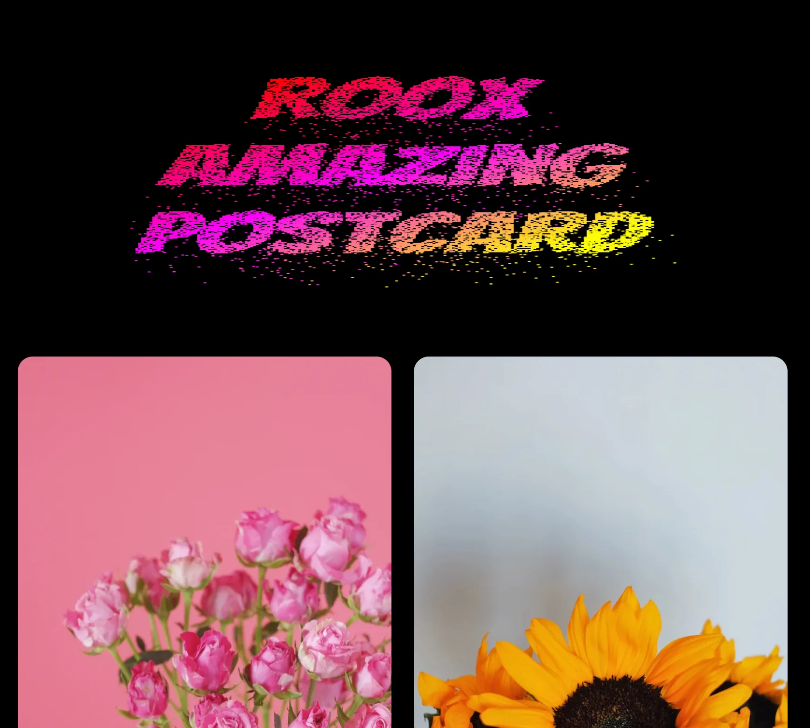

# Amazing Postcard with Canvas 🔥

## Задача

> Необходимо создать открытку, путем наложения текста на изображение и выгрузки ее в формате Jpeg

## Preview

## Проблема

> не решается простыми средствами html и css, так как невозможно получить однородный массив байтов
> на основе изображения и стилей

## Решение

- используем canvas, для связи байтов изображения и текста
- решаем проблему с переносом текста (канвас не умеет переносить текст автоматически)
- выполняем логику по конвертации канваса в Jpeg

## Tech Stack & main tools

- Html
- SCSS
- JavaScript (without frameworks and libraries, only vanilla with OOP)
- woff2 fonts
- webp images
- Parcel (Zero configuration builder)
- Canvas (🔥 Amazing technology)
